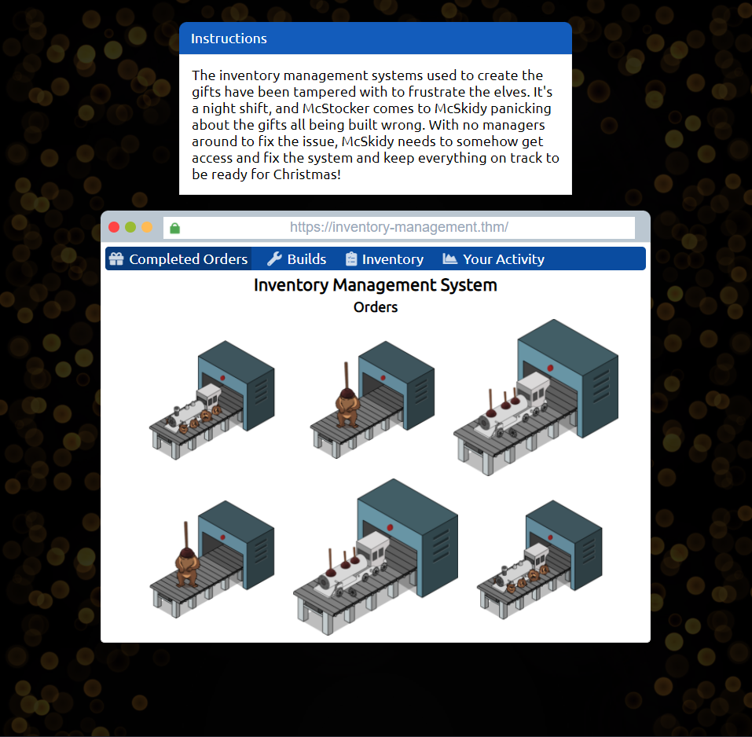
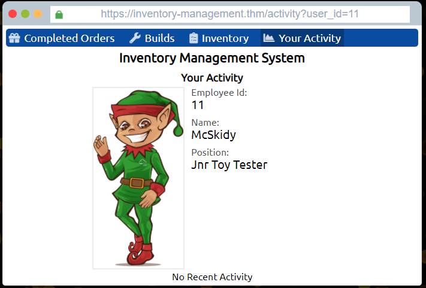
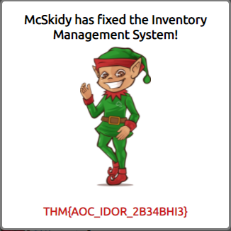
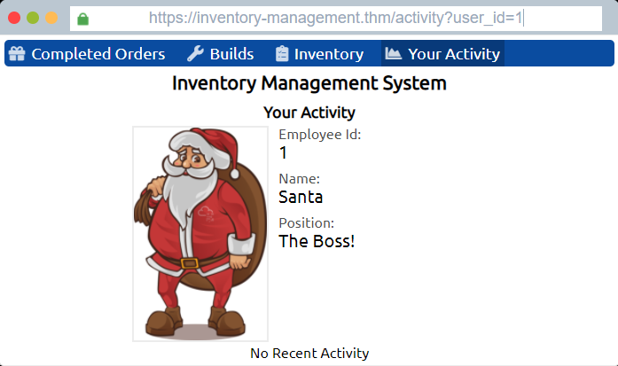

# Advent Of Cyber 3 (2021)

## 1 Gün

Öğretilen Bilgiler

IDOR (Güvensiz Nesne Doğrulama) Açığı Nedir ?

IDOR Nasıl Bulunur

------------------------------------------------------------------------------------

Öncelikle IDOR Nedir Ne Değildir??

IDOR, Güvensiz Doğrudan Nesne Başvurusu anlamına gelir ve bir tür erişim denetimi güvenlik açığıdır. 

Erişim denetimi güvenlik açığı, bir saldırganın kendisi için tasarlanmamış bilgilere veya eylemlere erişebilmesidir. 

Bir web sunucusu nesneleri (dosyalar, veriler, belgeler) almak için kullanıcı tarafından sağlanan girdiyi aldığında ve bu girdi verilerine çok fazla güvenildiğinde ve web uygulaması 

kullanıcının yapması gerekip gerekmediğini doğrulamadığında bir IDOR güvenlik açığı oluşabilir. Aslında, istenen nesneye erişiminiz var.

tryhackme'nin Açıklaması Ne Kadar Anladınız Bilmiyorum Fakat Birazda Biz İnceleyelim.

IDOR, İngilizce Açılımı Insecure Direct Object Reference

Örnek İle Anlatacak Olursak:

Bir Site Düşünün Sitenin Bir Yerine Geldiğinizde Sizin Adınız Ve Size Ait Gizli Bilgiler GÖzüküyor Diye Hayal Edin.
Sitenin Bu Kısmındaki Url Şöyle Olsun 'https://site.com/index.php?id=12'

Siz Buraya Baktığınızda Aklınıza Gelen İlk Şey Abi Bunu Değiştirsek Ne Olur? Yani Bir Hacker Gözü İle Bakıldığında Böyledir

İşte Tam Bu Kısmında Değişiklik Yapıpda Başka Bir Değer Alıyorsak Biz Buna IDOR Diyoruz.

Burada id=12 Parametresindeki 12 Değeri Şu Oluyor:
	
Git Bana 12.Kullanıcının şu şu Bilgilerini Getir

1 Yaptığımızda:

Git Bana 1.Kullanıcının(genelde admin olur) şu şu bilgilerini getir

Bu Çok Kaba Bir Açıklama Oldu Eğer Daha Fazla Öğrenmek İstiyorsanız Youtubeden Aratabilirsiniz Çok Güzel Bilgilendirici Videolar Var

Şimdi Uygulama Ve Çözümlere Geçelim:

Web Tabanlı AttackBox Başlatın

Açıldığında Bir Yazı İle Karşılaşıyoruz Bize Şöyle Birşey Söylüyor

McStocker Denen Abimizin Bir Şirketi Var Ve Noel Hediyeleri Satıyormuş Bu Site Elfler Tarafından Kurcalanmış Bunu Duyunca Panikleyip
McSkidy Abimize Söylemiş Ve Ondan Yardım İstemiş Bölümün Başındaki Hikayeyi Okuduysanız Bilirsiniz Bütün Çalışanları Elfler Kendi Tarafına Çekmiş
McStocker Abimizin Elinde Sadece McSkidy Kalmış Ondan Bu Sorunu Çözmesini İstemiş.

Siteye Bir Göz Atacak Olursak Belli Birkaç Yer Var En Dikkat Çeken Yer 'Your Activity'
Buraya Geldiğimizde McSkidy Abimizin Hesabındayız Ve Bilgileri Bize Gösteriliyor Linke Baktığımızda 'user_id=11' Olduğunu Görüyoruz 

Bu user_id Değerini Değiştirelim

1 Noel Baba (Santa)

2 ----

3 McStocker

4 ---

5 ---

6 ---

7 ---

8 ---

9 Grinch (Aradığımız Kişi)

Baktığımızda Grinch Birşeyleri Kurcalamış Ve Kendine Birşeyler Eklemiş Gibi Duruyor Hepsini Revert Ederek Görevimizi Tamamlıyoruz.

Son Olarak Sorulara Cevap Vermek Kaldı

1: Noel Baba'nın hesabını bulduktan sonra şirketteki pozisyonları nedir?

Cevap: Noel Babanın (santa) id değerinin 1 olduğunu söylemiştik Gidip Bakıyoruz Bakmanız Gereken Değer 'Position'

2: McStocker'ın hesabını bulduktan sonra şirketteki pozisyonları nedir?

Cevap: McStocker'ın id Değerini 3 Olarak Bulmuştuk Oradan Bakınız.

3: Kurcalamadan sorumlu hesabı bulduktan sonra, şirketteki pozisyonları nedir?

Cevap: Kurcalamayı Grinch Adlı Kullanıcının Yaptığını Söylemiştik id Değerini 9 Olarak Bulduk Oradan Bakabilirsiniz

4: McSkidy Envanter Yönetim Sistemini düzelttiğinde alınan bayrak nedir?

Cevap: Grinch Kullanıcısının Tüm Envanterini Sildiğinizde Tam Karşınıza THM{AOC-sad-sda} Gibi Birşey Gelecektir Bayrağı Cevap Olarak Ekleyin

Son Olarak Kendinizi Geliştirmek Ve IDOR Hakkında Daha Fazla Bilgi Edinmek İsterseniz;

> [TRYHACKME IDOR](https://tryhackme.com/room/idor)

> [MDISEC IDOR](https://www.youtube.com/watch?v=TsJ2XPuGe1k)
