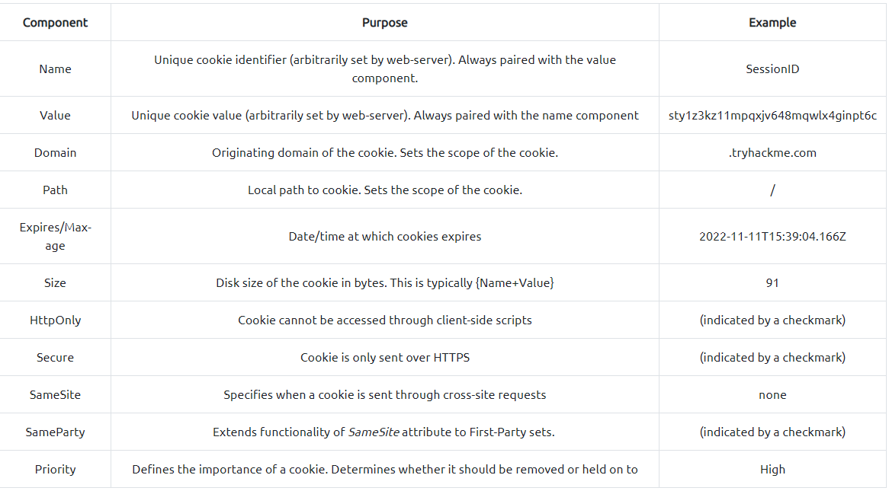

# Advent Of Cyber 3 (2021)
## 2 DAY

### Öğrenme Hedefleri;

Web İletişim Teknolojilerini Anlamak 

Cookie (Çerezler) Nedir Ne Amaçla Kullanılır

Çerezlerin Manipüle Edilmesi Ve Oturum Elde Etme

-----------------------------------------------------------------------------------------

HTTP(S) Nedir

Web Sitesi Bir Bilgisayarla İletişim Kurması İçin Aracı Bir Protokole İhtiyaç Duyar.
Ana 2 İletişim Türü Vardır;

1-HTTP
2-HTTPS

Açılımlarına Bakarsak Eğer HTTP(Hypertext Transfer Protocol) HTTPS(Hypertext Transfer Protocol Secure) Olarak Açabiliriz.
Tek Farkları HTTP Bir request Yani İstek Gönterdiğinde Bunu Şifrelemez. Buda Aynı Ağda Olan Bir Saldırganın MITMF Saldırısı İle
Modem Ve Kullanıcı Arasına Girer Paketler Şifreli Olmadığı İçin Saldırgan Bunları Görebilir.

HTTPS Bilümündeki Tek Fark Paketleri Şifrelemiş Olmasıdır Yani Araya Giren Bir Saldırgan Paketleri Asla İzleyemez.

Gelelim bunların gönderilme yöntemlerine biraz kaba bir tabir ama neyse;

İki methodumuz var bu istekleri göndermek için;

1-GET
2-POST

GET Nedir: Adı Gibidir URL'de Herşeyi Gösterir Uluslar Arası Standartlara Göre Çok Fazla GET (HTTP Parametre Kirliliği) Siteler İçin Bir Risk Faktörüdür.
Örnek Bir HTTP GET İsteği Gösterecek Olursak;

GET /test/demo_form.php?name1=value1&name2=value2 HTTP/1.1
Host: tryhackme.com
User-Agent: Mozilla/5.0 Firefox/87.0
Referer: https://tryhackme.com/

POST Methoduna Bakalım;

POST /test/demo_form.php HTTP/1.1
Host: tryhackme.com
name1=value1&name2=value2

Linkkısmında Gözüken Tarafa Baktığımızda Şöyle Bir Manzara Var Karşımızda;

GET-tryhackme.com/test/demo_form.php?name1=value1&name2=value2

POST-tryhackme.com/test/demo_form.php

POST Methodunda Linkdeki Değerler Paket İçerisine Gizleniyor Bu Sayede Saldırganın Değiştirebileceği Değerleri Biraz Gizlemiş Oluyor.

Sunucudan Gelen Cevaplar Yerine Göre Değişiyor

-------------------------------------------------------------------------------------------------------------------------------

COOKIE (Çerezler) Ve Manipülasyonları

Cookieleri bir örnek üzerinden açıklayalım,

Bir bakkal düşünün hiçbirşey hatırlamıyor bir defteri var oraya birşey isteyenlerin adını soy adını felan yazıyo ve ekmek su vs. isteyenlerede kağıt yapıştırıyor
ve o kağıtlara bakarak onların kim olduğunu hatırlıyor.

Buraya Kadar Çerezin Mantığını Anlamışsınızdır

Peki Manipülasyonu Nasıl Bir Senaryo İzliyor ??

biri geliyor diyorki ben ahmet bana ekmek ver
bakkal bakıyor kağıda tamam veriyor ekmeği tabi önce listeyi kontrol ediyor ki yanlış vermeyelim,

bunu gören mehmet bakıyo ahmetin üstünde kağıtla ahmet yazıyor, şimdi düşündüğümüz zaman bu bizim aptalı bizde kandırabiliriz üstüme gidip ahmet yazarım
oda zaten birşey hatırlamıyor yüz tanıma sistemide yok yazdık ahmeti gittik yumurta istedik ve mehmete yumurtayı verdi.

Bu Senaryo aslında birebir aynısı sadece çerezler şifreleniyor ve o şekilde sunuluyor.

(Cookielerin özelliklerine Gelelim Çerezler 11 Kısımdan Oluşur;

1-NAME                 (Web sunucu cookieye istediği adı verir)           Örn: "SessionId"

2-Value                (Kullanıcının cookiesidir ad ile bileşik olarak verilir, şifreli Halde Saklanır)      Örn: "c99a11a53a3748269e3f86d7ac38df11" (md5 hash)

3-Domain               (Çerezin ait olduğu siteyi belirtir)        Örn: "tryhackme.com"

4-Path                 (Çerezin Kullanılacağı Kapsamları İşaret Eder)    Örn:  "  /  "

5-Expires/Max-age      (Çerezin Geçerlilik Tarihini Belirtir)    Örn:  2022-11-11T15:39:04.166Z

6-Size                 (Bayt Cinsinden Çerezin Boyutunu belirtir)   Örn:   91

7-HttpOnly             (Yerel Veya Dış Ağdan Site Veya Sahipleri Göremez) Örn: (Onay İşateri İle Gösterilir)

8-Secure               (Çerez Bilgilerini Sadece HTTPS Üzerinden Göndererek Güvenliği Arttırır)  Örn: (Onay İşareti İle Gösterilir)

9-SameSite             (Siteler arası istekler aracılığıyla bir tanımlama bilgisinin ne zaman gönderildiğini belirtir)    Örn: (Yok)

10-SameParty           (SameSite özniteliğinin işlevselliğini Birinci Taraf kümelerine genişletir)   Örn:   (Onay İşareti İle Gösterilir)

11-Priority            (Bir çerezin önemini tanımlar. Kaldırılması mı yoksa tutulması mı gerektiğini belirler.) Örn: High/Med/Low)

Bu Maddelerin Bir Kısmı Çerezi Diğer Kısmı İse Çerezin Güvenliğini Sağlar.

Bir Paketi Yakaladığınızda Cookie Şu Şekilde Gözükür ``Set-Cookie: <cookie-name>=<cookie-value>; Domain=<domain-value>; Secure; HttpOnly``

Çerez Manipülasyonunda bunların hepsini değiştirmek biraz zor gelebilir ama genelde değiştireceğiniz kısım sadece value değeri olacaktır

Şimdi Bukadar Şey Öğrendik Ne Yapacaz Bunlarla;
Çerezleri İlde Ettiğinizde Bir Kişinin Dİrek Hesabına Erişirsiniz Şifre vs. Hiçbirşey Sorulmaksızın Eminim Bu Yeterli Olmuştur

Çerezleri Daha Kolay Değiştirmek İçin Tarayıcıya 'cookie editor' yazıp sizin tarayıcınıza uygun olanı seçip ekleyin resimdeki gibi olacaktır

Soruları Cevaplamaya Başlıyalım:

Statik Web Sitesini  [BURADAN](https://static-labs.tryhackme.cloud/sites/aoc-cookies/) Açın

1-Hesap Oluşturduğunuzda Cookie Adresinin Name Değeri Nedir?
Cevap: Cookie-Editorden Bakabilirsiniz

2-Çerez Değerleri Hangi Türde Kodlandı?
Cevap: [CyberChef](https://gchq.github.io/CyberChef/) Aracığılığı İle Kodu Çözebilirsiniz. (Sihirbazlık Yapın)
hexadecimal
3-Çerezin verileri hangi nesne biçiminde depolanıyor?

Cevap: F12 Tuşuna Basarak sources kısmına gelin 'fromtocookie.js'  dosyası cookieler için yapılandırılmış
Dosyanın İçeriğine Baktığınızda Klasik Bir JSON dosyası olduğunu göreceksiniz.

4-Yönetici çerezinin değeri nedir? (kullanıcı adı = yönetici)

Cevap: Hexadecimal Olarak Çözüğümüz Kodun User Kısmını Admin Olarak Değiştip Tekrar Encode Edin Ve Value Kısmına Yapıştırıp Kaydeyin Ve Sayfayı Yenileyin Encode
Ettiğiniz Sorunun Cevabı

Diğer Soruları Uygulamaya Giriş Yaptıktan Sonra Cevaplıyabilirsiniz.

Ek Kaynaklar;

[TRYHACKME](https://tryhackme.com/jr/authenticationbypass)
