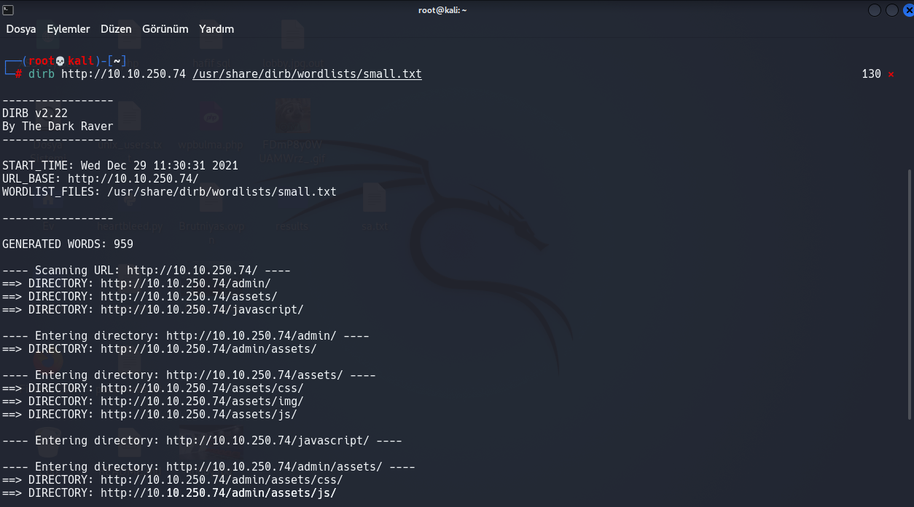

# Advent Of Cyber 3 (2021)

## 3DAY

Bu Gün Öğreneceklerimiz İçerik Keşfi Ve İçeriklerin Kötü Amaçlarla Kullanılması

İçerik aramaya başlamadan önce, "içeriğin" gerçekte ne olduğunu tanımlayalım. İçerik,

test ettiğimiz uygulamanın varlıkları ve iç çalışmalarıdır.
İçerikler, genel halk tarafından mutlaka erişilmesi amaçlanmayan dosyalar, klasörler veya yollar olabilir.

Örneğin, 

Örneğin, lezzetli ikramlarınız hakkında paylaşımlarda bulunduğunuz bir blogunuz olabilir! Herkesin tüm lezzetli atıştırmalıklarınızı görmesini istiyorsunuz,
ancak herkesin hangi lezzetli atıştırmalıkların incelenmek üzere olduğunu yönetmesini istemiyorsunuz - Yönetici panelini halktan uzakta gizleyebilirsiniz!

Örneği Gerçeğe Taşıyalım;

Web Sunucusunda Public Ve Private Olarak İki İçerik Türü Vardır, 

Public İçerik İnsanların Görmesini İstediğimiz Makaleler Reklamlar, Yazılar, Resimler vs.

Private İçerikse Özel Giriş Kısımları, Sistemin Özel Dosyaları, Şifrelerin Bulunduğu Dosyalar, Klasörler vs.

Private Bilgilerin Halka Açık Olması Durumunda Sisteme Sızılabilir, Önemli Bilgiler İnternete Sızdırılabilir, Veya Siteye Üye Olmuş Bütün Kullanıcıların Bilgileri Çalınabilir.

Bu Yüzden İçerik Keşfi Her Zaman Önemlidir.

--------------------------------------------------------------------------------------------------------------

Şimdi Gizli Dizinleri Ve Dosyaları Bulmaya Çalışalım.

Gizli Dizin Ve Dosyaları Bulan Bir Aracımız Var Kendisi Parrot Kali Gibi Linux Sistemlerde Kurulu Olarak Geliyor

Adı: DİRB

Konsol Tabanlı Bir Uygulama 

Kullanımı

	dirb http://site.com/
	
Eğer Kendi Listenizi Kullanmak İstiyorsanız 

	dirb http://site.com/ /bulunduğu/yer/ve/adı.txt

Şeklinde Girin

Siteye Tarama Yaptığızda Böyle Bir Sonuçla Karşılaşabilirsiniz;

Bizim İçin Önemli Olan admin Bilgisiydi

Linke Gittiğimizde Bizi Bir Giriş Sayfası Karşılıyor 

Bize Verilen Bilgilere Göre Kullanıcı Adı Ve Şifre Bunlardan Birisiymiş

Sıra Sıra Denediğimizde administrator:administrator Şeklinde Kullanıcı Adı Ve Parolayı Buluyoruz.

Giriş Yaptığımızda Bizi Bir Sayfaya Yönlendiriyor Ve 3.Günü Tamamlamış Oluyoruz

--------------------------------------------------------------------------------------------------------

Sorulara Başlıyalım;

1-Bulduğunuz Gizli Klasörün Adı Nedir?

Cevap: Dirb İle Yaptığımız Taramada Bu Bilgiyi admin Olarak Bulmuştuk

2-administrator Kullanıcısının Şifresi Nedir?

Cevap: Yaptığımız Denemelerde Şifreyi Kullanıcı Adı İle Aynı Bulmuştuk

3-Giriş Yaptığınızda Ana Sayfadaki Bayrak?

Cevap: Giriş Yaptığınızda Ana Sayfada (Resimlerden Birinde Verdim giriş Yapıp Bulun Onuda)

Ek Kaynaklar

[İçerik Keşfi](https://tryhackme.com/jr/contentdiscovery)

[Kimlik Doğrulama Bypass](https://tryhackme.com/jr/authenticationbypass)
